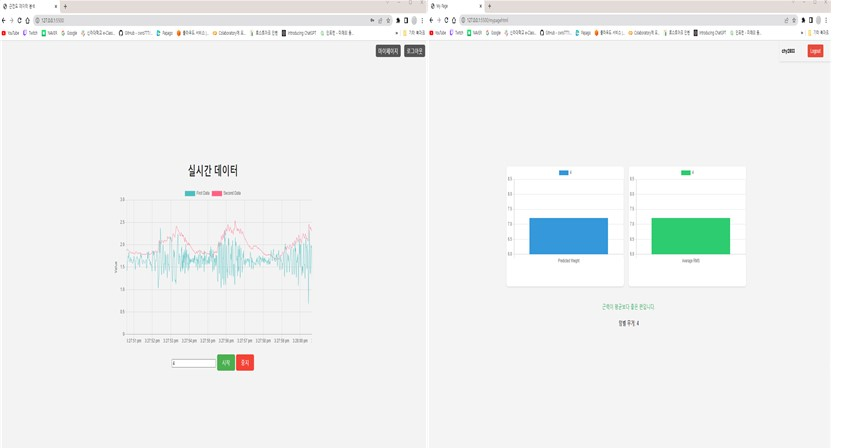
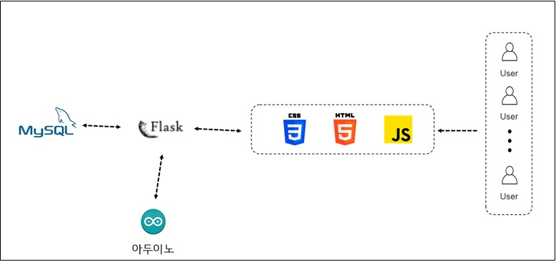

# [Arduino EMG Sensor Visualizing Project]

](img/2.jpg)
---

 

# 📖 Contents

- [🛠 Features](#-features)
- [📈 Architecture](#-Architecture)
- [🪃 Skills](#-skills)
  - [Client](#client-1)
  - [Server](#server-1)
- [🧗 Challenges](#-challenges)
- [🙏 마무리하며..](#-마무리하며)

 

# 🛠 Features
  - Main Page: 실시간 근전도 센서를 통한 데이터 시각화 확인 가능
  - My Page: 데이터를 통한 운동능력 결과확인 가능 
  - Login : 로그인 기능  
 

# 📈 Architecture

 

# 🪃 Skills

## Client

- HTML, CSS, JavaScript, Python

## Server

- Python
- Flask
- AWS

## Version Control

- Git, Github

 

# 🧗 Challenges

기능 개발을 하면서 겪은 어려움 또는 도전은 아래와 같습니다.

 

개념 설계 목표 : 근전도 데이터를 수집하고 분석하여 개인화된 운동 프로그램을 제공하고, 실시간 모니터링 및 피드백 시스템을 구축하느것

- 요구사항 분석 : 근전도 데이터 수집, 개인화된 운동 프로그램, 실시간 모니터링 및 피드백 시스템에 대한 요구사항 도출
- 시스템 구성 설계 : 근전도 센서, 데이터 수집 시스템, 데이터 전처리 및 신호 분석 알고리즘 등 시스템의 구성 요소를 설계
- 실시간 모니터링 및 피드백 시스템 구축 : 실시간 데이터 수집, 분석 및 피드백 시스템을 개발하여 운동자에게 실시간 지도와 피드백 제공

# 🙏 마무리하며...
프로젝트를 진행하며 주제를 정하는게 가장 어려웠던거 같고 그걸 팀원끼리 회의하며 정해나가는 과정이 즐거웠던거 같습니다. 
